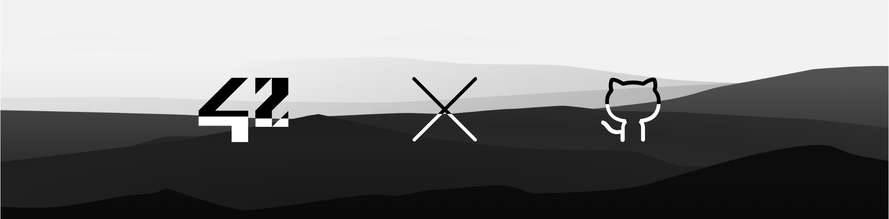

## Hi there, I'm Kevin 👋

### 🙋 **About me**
* 42Lausanne student from Switzerland  
* Platform Engineer & DevOps enthusiast — building infrastructure that scales

---

### **Core Infrastructure Skills**
  
Terraform • Ansible • Infrastructure as Code

### **Containerization & Orchestration**
  
Docker • Kubernetes • K3s

### **Cloud Platforms**
  
AWS (Lambda, EC2, IAM, DynamoDB, etc.) • Azure (VMs)

### **monitoring and observability**
  
Prometheus • Grafana

### **Automation & CI/CD**
  
GitHub Actions • GitLab CI/CD • Git

### **Languages & Scripting**
  
Python • JavaScript/TypeScript • Bash

---

### 🔨 **Currently Working On**
* **[EduChat](https://github.com/0xCAF3D0OD/EduChat)** — Full-stack app (Vue.js frontend, FastAPI backend) migrating from Docker Compose → Kubernetes
* **[ansible-azure](https://github.com/0xCAF3D0OD/ansible-azure)** — Terraform + Ansible deployment on Azure
* **[Inception-of-Things](https://github.com/0xCAF3D0OD/IoT-Vagrant-K3s)** — K3s cluster management with Vagrant & VirtualBox

---

### 🎯 **What Drives Me**
I like building, learning in the open, and sharing what I discover. Not alone — alongside people who care about infrastructure, automation, and doing things right.

### 🎓 **what is:** 42Lausanne
* 🏫&nbsp;&nbsp;&nbsp; 42Lausanne is a computer science school part of 42 network.

  >**42 is a future-proof computer science training to educate the next generation of software engineers.** The 42 program takes a project-based approach to progress and is designed to develop technical and people skills that match the expectations of the labor market.
  >
  >But not only that, 42Lausannne is a real hive without queen, all the students bring their stone to the building, the notion of teamwork has never been as present as in this school. Find yourself a group of friends and go on an adventure in the multitude of projects that the school offers.

* ℹ&nbsp;&nbsp; For more information check &nbsp;&nbsp;&nbsp;[42lausanne](https://www.42lausanne.ch/)
### 🏃 **What i like to do:** 
* I like to do sports, I find it liberates the mind. As for computer science, it allows us to create interactions with others, to surpass ourselves, to find new challenges.

## Social media
* **You can follow me on these social networks**

&nbsp;&nbsp;&nbsp;&nbsp;&nbsp;&nbsp;&nbsp;
&nbsp;&nbsp;&nbsp;&nbsp;&nbsp;

